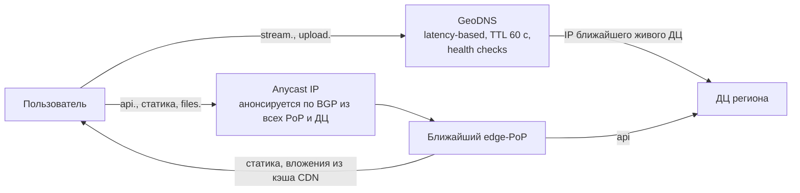
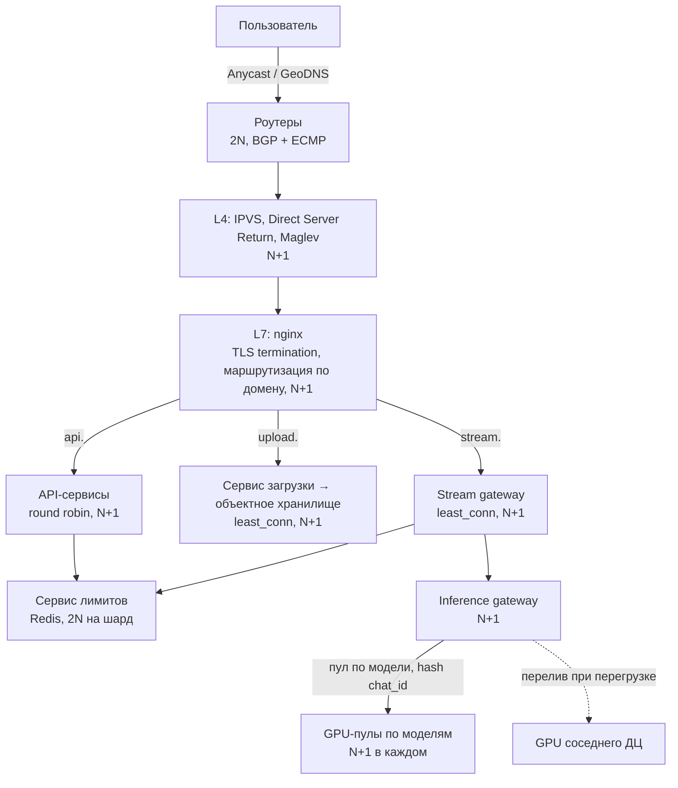

# highloadDZ2026

Домашнее задание по курсу "Проектирование высоконагруженных систем".

## 1. Тема и целевая аудитория

В данной работе будет спроектирована архитектура сервиса-ассистента на базе больших языковых моделей - по образцу Claude от Anthropic. Прямые рыночные аналоги - ChatGPT от OpenAI и Gemini от Google - подтверждают существование ниши и её масштаб: это один из самых быстрорастущих типов потребительских сервисов за последние годы.

Целевая аудитория - массовый пользователь веба и мобильных приложений по всему миру (частные лица и сотрудники компаний). По данным отчёта Sensor Tower "State of AI 2026", у Claude около 245 млн месячных активных пользователей на web и mobile. Такой масштаб аудитории в сочетании с тем, что каждый запрос требует дорогого инференса на GPU (а не просто отдачи статики или строки из БД), делает архитектуру сервиса нетривиальной: нагрузка высока и по RPS на бекенд, и по вычислениям на кластере инференса.

## Функционал MVP

Ключевые функции, вокруг которых будет проектироваться система:

1. Отправка сообщения и потоковое (Token-by-token, TBT) получение ответа модели
2. Хранение истории переписки на сервере и список чатов пользователя
3. Синхронизация чатов между несколькими устройствами одного пользователя
4. Подсчёт токенов запроса и ответа в реальном времени и управление лимитами (квоты на пользователя/чат, остаток лимита, блокировка при превышении)
5. Прикрепление файлов к сообщению (изображения, документы, PDF)
6. Выбор модели под задачу (быстрая и дешёвая vs более мощная и дорогая - напрямую влияет на расход токен-лимита)

## Ключевые продуктовые решения

- История чатов хранится на сервере, а не только на клиенте (в отличие, например, от WhatsApp) - это нужно для синхронизации между устройствами и доступа с любого клиента
- Ответ модели отдаётся потоково через SSE/WebSocket, а не единым блоком по готовности - снижает воспринимаемую задержку (Time to First Byte, TTFB), критичную при долгом инференсе
- Инференс-кластер отделён от основного бекенда и масштабируется независимо: именно GPU-инференс, а не запросы к БД, является главным потребителем ресурсов и основным источником нагрузки
- Лимиты и биллинг считаются в токенах, а не в запросах: у каждого пользователя/чата есть квота на входные+выходные токены за период, и её нужно списывать почти в реальном времени (по мере генерации ответа), а не одной операцией после завершения запроса - это требует быстрого и консистентного учёта расхода под высокой конкурентной нагрузкой

## 2. Расчёт нагрузки

Anthropic не публикует DAU, интенсивность использования, объём хранения и RPS. Сделаем некоторую аппроксимацию - калибруемся по конкуренту (ChatGPT), у которого есть публичные цифры:

- MAU ChatGPT = 1 млрд (июнь 2026, Reuters)
- WAU ChatGPT = >1 млрд (31 июля 2026, подтверждено OpenAI, см. The Information)
- 2.5 млрд запросов/сутки глобально (OpenAI, июль 2025, см. TechCrunch)

Отсюда интенсивность: `2.5 млрд / 1 млрд MAU = 2.5` сообщения в сутки на одного MAU-пользователя - это будет ориентиром. Применяем его к аудитории Claude: `245 млн × 2.5 ≈ 612.5 млн` сообщений в сутки, на одного DAU - `612.5 млн / 49 млн ≈ 12.5`.

Размеры сообщений берём из открытого датасета реальных диалогов ShareChat: запрос в среднем ~135 токенов, ответ ~1 115 токенов, в диалоге с Claude в среднем 4.49 сообщения. Принимаем 1 токен ≈ 4 байта текста (UTF-8, преимущественно латиница).

Остальные допущения - по ним публичных цифр нет даже у ChatGPT:

- DAU/MAU = 20% (в СМИ для ChatGPT называют ~190-210 млн DAU при ~1 млрд MAU - тот же порядок, но это не первоисточник, поэтому используем только как сверку)
- Частота второстепенных действий (список чатов, поиск, вложения, смена модели) задана как пропорция от отправки сообщений
- Пик/среднее = x4 (глобальная аудитория размазывает суточный пик по часовым поясам сильнее, чем у локального сервиса, но вечерние пики US+Европа всё равно накладываются)
- Вложение в среднем 0.5 МБ, каждое просматривается из истории ~2 раза

Основные формулы:

```
DAU                  = MAU × 0.2
Сообщений/сутки      = MAU × 2.5
N_тип/сутки          = DAU × (действий этого типа на пользователя в день)
RPS_средний          = N_тип/сутки / 86 400
RPS_пиковый          = RPS_средний × 4
V_сутки              = N/сутки × размер объекта
Трафик, Гбит/с       = V_сутки × 8 / 86 400
Прирост за год       = V_сутки × 365
Прирост на польз/год = V_сутки × 365 / DAU
```

### Продуктовые метрики

| Метрика                                  | Значение            |
| ---------------------------------------- | ------------------- |
| MAU                                      | 245 млн             |
| DAU                                      | ~49 млн             |
| Прирост хранилища на пользователя за год | ~170 МБ             |
| — сообщения (пары запрос-ответ)          | ~4 560 шт / ~23 МБ  |
| — чаты                                   | ~1 020 шт / ~0.5 МБ |
| — вложения                               | ~290 шт / ~146 МБ   |
| Отправка сообщения                       | ~12.5 шт/день       |
| Открытие списка чатов / истории чата     | ~8 шт/день          |
| Просмотр вложения из истории             | ~1.6 шт/день        |
| Прикрепление файла                       | ~0.8 шт/день        |
| Смена модели                             | ~0.5 шт/день        |
| Поиск по истории                         | ~0.3 шт/день        |

### Хранение (суточный прирост)

Для хранения важнее не накопленный объём на пользователя, а скорость прироста:

- Сообщения: `612.5 млн × (135 + 1 115) токенов × 4 Б ≈ 612.5 млн × 5 КБ ≈ 3.06 ТБ/сутки`
- Чаты: `612.5 млн / 4.49 ≈ 136 млн` новых чатов в сутки, метаданные ~0.5 КБ
- Учёт токенов: одна запись на запрос (user_id, chat_id, модель, input/output токены, время) ~100 Б
- Вложения: `49 млн × 0.8 × 0.5 МБ ≈ 19.6 ТБ/сутки`

| Тип данных           | Объектов/сутки | Объём/сутки | Прирост/год |
| -------------------- | -------------- | ----------- | ----------- |
| Сообщения            | 612.5 млн      | ~3.06 ТБ    | ~1.1 ПБ     |
| Метаданные чатов     | 136 млн        | ~0.07 ТБ    | ~25 ТБ      |
| Записи учёта токенов | 612.5 млн      | ~0.06 ТБ    | ~22 ТБ      |
| Вложения             | 39.2 млн       | ~19.6 ТБ    | ~7.2 ПБ     |
| Итого                | -              | ~22.8 ТБ    | ~8.3 ПБ     |

### Токены (нагрузка на учёт лимитов и инференс)

На вход модели уходит не только новое сообщение, но и история чата: в среднем перед сообщением в чате `(4.49 - 1) / 2 ≈ 1.75` предыдущих пар, т.е. `135 + 1.75 × 1 250 ≈ 2 325` входных токенов на запрос.

| Тип токенов               | Среднее, токенов/с | Пик, токенов/с |
| ------------------------- | ------------------ | -------------- |
| Входные (с историей чата) | ~16.5 млн          | ~66 млн        |
| Выходные                  | ~7.9 млн           | ~31.6 млн      |

### Сетевой трафик

- Стриминг ответа: SSE-событие на ~4 токена, ~100 Б обвязки на событие → `1 115 / 4 × 100 Б + 4.5 КБ ≈ 32.5 КБ`, плюс запрос ~1.5 КБ ⇒ ~34 КБ на сообщение
- Список чатов / история чата: ~10 КБ (gzip)
- Вложения раздаются через CDN

| Тип трафика            | Объём/сутки | Средний, Гбит/с | Пиковый, Гбит/с |
| ---------------------- | ----------- | --------------- | --------------- |
| Стриминг сообщений     | ~20.8 ТБ    | ~1.9            | ~7.7            |
| Загрузка вложений      | ~19.6 ТБ    | ~1.8            | ~7.3            |
| Раздача вложений (CDN) | ~39.2 ТБ    | ~3.6            | ~14.5           |
| Список чатов / история | ~3.9 ТБ     | ~0.4            | ~1.5            |
| Итого                  | ~83.5 ТБ    | ~7.7            | ~31             |

### RPS по типам запросов

| Тип запроса                          | Запросов/сутки | RPS средний | RPS пиковый |
| ------------------------------------ | -------------- | ----------- | ----------- |
| Отправка сообщения (chat completion) | 612.5 млн      | ~7 090      | ~28 360     |
| Проверка/списание токен-лимита\*     | 612.5 млн      | ~7 090      | ~28 360     |
| Список чатов / история               | 392 млн        | ~4 540      | ~18 160     |
| Просмотр вложения (CDN)              | 78.4 млн       | ~910        | ~3 640      |
| Прикрепление файла                   | 39.2 млн       | ~450        | ~1 800      |
| Смена модели                         | 24.5 млн       | ~280        | ~1 120      |
| Поиск по истории                     | 14.7 млн       | ~170        | ~680        |

\* внутренний запрос, привязан 1:1 к отправке сообщения (списывается по мере стриминга ответа)

## 3. Глобальная балансировка нагрузки

### Функциональное разбиение по доменам

| Домен                      | Назначение                                                 | Балансировка |
| -------------------------- | ---------------------------------------------------------- | ------------ |
| `assistant.example`        | Веб-клиент, статика                                        | CDN, Anycast |
| `api.assistant.example`    | Список чатов, история, поиск, смена модели, остаток лимита | Anycast      |
| `stream.assistant.example` | Отправка сообщения и SSE-стриминг ответа                   | GeoDNS       |
| `upload.assistant.example` | Загрузка вложений                                          | GeoDNS       |
| `files.assistant.example`  | Раздача вложений                                           | CDN, Anycast |

Короткие stateless-запросы (`api`, статика, файлы) идут через Anycast: смена BGP-маршрута посреди запроса им почти не страшна. Долгие соединения (`stream` - ~20 с на ответ, `upload`) идут через GeoDNS, чтобы соединение гарантированно оставалось в одном ДЦ.

### Расположение ДЦ

По данным Anthropic Economic Index на США приходится 21.6% использования Claude.ai, дальше идут Индия (~7%), Бразилия, Япония и Южная Корея (по ~3.5%); использование сильно коррелирует с ВВП на душу населения, поэтому значимая доля - у Европы. Точного разбиения по регионам нет, поэтому доли ниже - оценка:

| ДЦ                  | Обслуживаемые регионы                      | Доля (оценка) |
| ------------------- | ------------------------------------------ | ------------- |
| US-East (Вирджиния) | Восток Северной Америки, Латинская Америка | 25%           |
| US-West (Орегон)    | Запад Северной Америки                     | 11%           |
| Франкфурт           | Европа, Ближний Восток, Африка             | 34%           |
| Сингапур            | Южная и Юго-Восточная Азия, Океания        | 18%           |
| Токио               | Восточная Азия                             | 12%           |

Обоснование:

- GPU-кластеры требуют много электроэнергии, поэтому ставим крупные ДЦ в пяти регионах, а не в каждой стране; ближе к пользователям - edge-PoP (CDN и TLS-терминация)
- Влияние на продуктовые метрики: трансокеанский RTT 150-250 мс против <50 мс внутри региона добавляется ко времени до первого токена (TTFT) и особенно заметен на запросах `api` (открытие списка чатов, истории). Сам стриминг от RTT почти не зависит
- Европа выделена отдельно ещё и из-за GDPR: чаты пользователей ЕС хранятся в ЕС
- Латинская Америка обслуживается из US-East (~120 мс до Сан-Паулу - приемлемо для LLM-сервиса), статика - с локального edge-PoP

### Распределение запросов по ДЦ (пик)

`Пик_ДЦ = Пик_глобальный × доля ДЦ`. Трафик через ДЦ - без раздачи вложений (её берёт на себя CDN): `7.7 + 7.3 + 1.5 ≈ 16.4 Гбит/с`.

| ДЦ        | Отправка сообщения | Список чатов / история | Загрузка файлов | Трафик, Гбит/с |
| --------- | ------------------ | ---------------------- | --------------- | -------------- |
| US-East   | 7 090              | 4 540                  | 450             | ~4.1           |
| US-West   | 3 120              | 2 000                  | 200             | ~1.8           |
| Франкфурт | 9 640              | 6 170                  | 610             | ~5.6           |
| Сингапур  | 5 100              | 3 270                  | 320             | ~3.0           |
| Токио     | 3 400              | 2 180                  | 220             | ~2.0           |

### Схема DNS и Anycast балансировки



### Регулировка трафика между ДЦ

- Отключение ДЦ (авария или работы): снимаем BGP-анонс Anycast-адресов и убираем ДЦ из ответов GeoDNS - за ~TTL (60 с) новые соединения уходят в соседний ДЦ
- Перелив инференса: если в ДЦ перегружены GPU (растёт очередь, нарушается SLO по TTFT), inference gateway отправляет генерацию в соседний ДЦ по магистральной сети - лишние ~100 мс незаметны на фоне ~20 с генерации. Тяжёлые модели могут быть развёрнуты не во всех ДЦ - тогда запрос маршрутизируется туда, где модель есть
- Токен-лимиты: счётчик квоты пользователя живёт в его "домашнем" регионе. Чтобы не ходить через океан на каждое сообщение, ДЦ берёт у домашнего региона "аренду" части остатка квоты (например, 10%) и списывает локально; неизрасходованное возвращается асинхронно. Возможное превышение лимита ограничено размером аренды

## 4. Локальная балансировка нагрузки

### Схема балансировки



| Уровень                | Резервирование                | Почему                                                                                 |
| ---------------------- | ----------------------------- | -------------------------------------------------------------------------------------- |
| Роутеры                | 2N                            | Отказ роутера отключает весь ДЦ                                                        |
| L4 (IPVS)              | N+1                           | Узлы взаимозаменяемы; Maglev даёт одинаковый выбор L7 на всех L4, соединения не рвутся |
| L7 (nginx)             | N+1                           | Отказ узла снижает только общую мощность                                               |
| API, stream gateway    | N+1                           | То же                                                                                  |
| Сервис лимитов (Redis) | 2N (мастер + реплика на шард) | Потеря счётчика = либо бесплатные токены, либо ложные блокировки                       |
| GPU-пулы               | N+1 на каждую модель          | Отказ узла не должен делать модель недоступной                                         |

Алгоритмы: роутеры → L4 - ECMP; L4 → L7 - Maglev (consistent hashing по 5-tuple); `api` - round robin (короткие запросы); `stream` и `upload` - least_conn (долгие соединения); inference gateway → GPU - сначала пул нужной модели, внутри пула hash по `chat_id` (переиспользование KV/prefix-кэша истории чата), при перегрузке узла - узел с наименьшей очередью.

### Расчёт количества балансировщиков

Пиковый внешний RPS через L7 (без CDN и внутренней проверки лимитов): `28 360 + 18 160 + 1 800 + 1 120 + 680 ≈ 50 120`. Оценка сверху - каждый запрос открывает новое TLS-соединение.

- SSL termination, данные 2017 г. (RSA-2048): 428 CPS на ядро; масштабирование упирается в ~10 000 CPS на сервер (24 ядра) ⇒ `50 120 / 428 ≈ 117` ядер глобально
- SSL termination, данные 2019 г.: 4 433 TPS на ядро ⇒ `50 120 / 4 433 ≈ 12` ядер - считаем по более строгим данным 2017 г.
- Обработка HTTPS-запросов (1 КБ): 28 640 RPS на ядро ⇒ ~2 ядра - не ограничитель
- Одновременные SSE-стримы: ответ длится `1 115 токенов / ~60 токенов/с + ~1 с TTFT ≈ 20 с` ⇒ `28 360 × 20 ≈ 570 тыс.` открытых соединений глобально (во Франкфурте ~190 тыс.). nginx держит сотни тысяч соединений на сервер - не ограничитель, но `worker_connections` нужно поднять
- Сеть: максимум во Франкфурте ~5.6 Гбит/с, сервер с 25 GbE при загрузке 70% - 17.5 Гбит/с - не ограничитель
- L4 в режиме DSR пропускает только входящий трафик (запросы и загрузки, ~7.6 Гбит/с глобально) - не ограничитель, ставим по 2 на ДЦ

`Серверов nginx = ⌈Пиковый RPS ДЦ / 10 000⌉ + 1`

| ДЦ        | Пиковый RPS | Ядер на TLS | Серверов nginx | Серверов L4 | Роутеров |
| --------- | ----------- | ----------- | -------------- | ----------- | -------- |
| US-East   | 12 530      | 30          | 3 (+1)         | 2           | 2        |
| US-West   | 5 510       | 13          | 2              | 2           | 2        |
| Франкфурт | 17 040      | 40          | 3 (+1)         | 2           | 2        |
| Сингапур  | 9 020       | 22          | 2              | 2           | 2        |
| Токио     | 6 010       | 15          | 2              | 2           | 2        |

US-East и Франкфурт резервируют друг друга: при отказе одного второй получает `12 530 + 17 040 ≈ 29 600 RPS` ⇒ 3 рабочих сервера, поэтому для сохранения N+1 в аварии добавляем им по одному серверу (+1). Итого: 14 серверов nginx, 10 серверов L4, 10 роутеров.

## Источники

- [Sensor Tower — State of AI 2026](https://sensortower.com/blog/state-of-ai-2026) - оценка MAU Claude (245 млн web+mobile) и динамика роста
- [TechCrunch — Anthropic's Claude is winning over paid consumers](https://techcrunch.com/2026/06/25/anthropics-claude-is-winning-over-paid-consumers-a-market-owned-by-chatgpt/) - независимое подтверждение роста аудитории и выручки на основе данных Sensor Tower
- [The Information — OpenAI's ChatGPT nears 1 billion weekly active users](https://www.theinformation.com/articles/openais-chatgpt-nears-1-billion-weekly-active-users-seven-months-target) - официальное подтверждение OpenAI: >1 млрд WAU на 31 июля 2026, 900 млн в феврале 2026
- [TechCrunch — ChatGPT users send 2.5 billion prompts a day](https://techcrunch.com/2025/07/21/chatgpt-users-send-2-5-billion-prompts-a-day/) - интенсивность использования (запросов/сутки), источник ориентира для сообщ./пользователя/день
- [ShareChat: A Dataset of Chatbot Conversations in the Wild](https://github.com/raye22/ShareChat) - средний размер запроса/ответа в токенах, среднее число сообщений в диалоге с Claude
- [Anthropic Economic Index — geography](https://www.anthropic.com/research/economic-index-geography) - распределение использования Claude.ai по странам
- [Testing the Performance of NGINX and NGINX Plus Web Servers (2017)](https://blog.nginx.org/blog/testing-the-performance-of-nginx-and-nginx-plus-web-servers) - CPS для HTTPS
- [Testing the Performance of NGINX Ingress Controllers in Kubernetes (2019)](https://blog.nginx.org/blog/testing-performance-nginx-ingress-controller-kubernetes) - TLS TPS и HTTPS RPS
